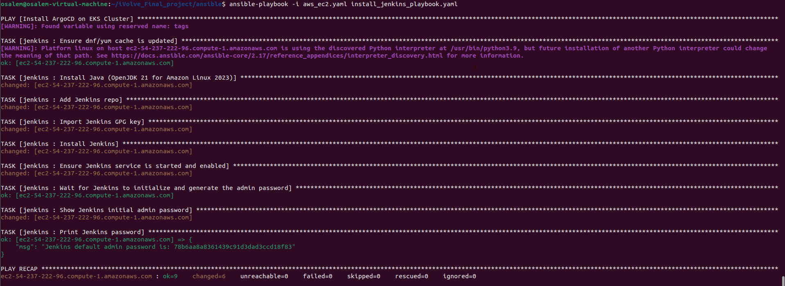

# Ansible Automation Documentation

## 📋 Overview

This directory contains Ansible playbooks and roles for automating the deployment and configuration of infrastructure components in the iVolve Final Project. The automation covers Jenkins installation, EKS cluster setup, and EC2 instance management.

## 🏗️ Directory Structure

```
Ansible/
├── README.md                           # This documentation file
├── ansible.cfg                         # Ansible configuration
├── aws_ec2.yaml                       # EC2 instance management playbook
├── Install_jenkins_playbook.yaml      # Jenkins installation playbook
├── EKS_ansible_playbook.yaml          # EKS cluster setup playbook
└── roles/
    ├── jenkins/                        # Jenkins installation role
    │   └── tasks/
    │       └── main.yaml              # Jenkins installation tasks
    └── eks/                           # EKS cluster role
        └── tasks/
            └── main.yaml              # EKS setup tasks
```

## 🔧 Configuration

### ansible.cfg

The Ansible configuration file contains essential settings:

```ini
[defaults]
host_key_checking = False
inventory = inventory.ini
remote_user = ec2-user
private_key_file = ~/.ssh/your-key.pem
```

**Key Settings:**
- **host_key_checking = False**: Disables SSH host key verification
- **inventory**: Points to the inventory file
- **remote_user**: Default user for SSH connections
- **private_key_file**: Path to SSH private key

## 📜 Playbooks

### 1. Install_jenkins_playbook.yaml



**Purpose**: Installs and configures Jenkins on EC2 instances

**Usage**:
```bash
ansible-playbook -i inventory.ini Install_jenkins_playbook.yaml
```

**What it does**:
- Updates system packages
- Installs Java 21 (Amazon Corretto)
- Adds Jenkins repository
- Installs Jenkins
- Starts and enables Jenkins service
- Retrieves initial admin password

**Target Hosts**: All hosts in inventory

**Prerequisites**:
- EC2 instances running Amazon Linux 2023
- SSH access configured
- Proper security groups allowing port 8080

### 2. EKS_ansible_playbook.yaml


**Purpose**: Sets up Amazon EKS cluster

**Usage**:
```bash
ansible-playbook -i inventory.ini EKS_ansible_playbook.yaml
```

**What it does**:
- Installs AWS CLI
- Installs kubectl
- Installs eksctl
- Creates EKS cluster
- Configures kubectl for cluster access

**Target Hosts**: Control node or local machine

**Prerequisites**:
- AWS credentials configured
- Proper IAM permissions for EKS

### 3. aws_ec2.yaml

**Purpose**: Manages EC2 instances

**Usage**:
```bash
ansible-playbook -i inventory.ini aws_ec2.yaml
```

**What it does**:
- Creates EC2 instances
- Configures security groups
- Sets up networking

## 🎭 Roles

### Jenkins Role (`roles/jenkins/`)

**Location**: `roles/jenkins/tasks/main.yaml`

**Tasks Breakdown**:

1. **Update Package Cache**
   ```yaml
   - name: Ensure dnf/yum cache is updated
     yum:
       update_cache: yes
   ```

2. **Install Java**
   ```yaml
   - name: Install Java (OpenJDK 21 for Amazon Linux 2023)
     yum:
       name: java-21-amazon-corretto
       state: present
   ```

3. **Add Jenkins Repository**
   ```yaml
   - name: Add Jenkins repo
     get_url:
       url: https://pkg.jenkins.io/redhat-stable/jenkins.repo
       dest: /etc/yum.repos.d/jenkins.repo
       mode: '0644'
   ```

4. **Import GPG Key**
   ```yaml
   - name: Import Jenkins GPG key
     rpm_key:
       key: https://pkg.jenkins.io/redhat-stable/jenkins.io.key
       state: present
   ```

5. **Install Jenkins**
   ```yaml
   - name: Install Jenkins
     yum:
       name: jenkins
       state: present
   ```

6. **Start and Enable Service**
   ```yaml
   - name: Ensure Jenkins service is started and enabled
     systemd:
       name: jenkins
       state: started
       enabled: yes
   ```

7. **Wait for Initialization**
   ```yaml
   - name: Wait for Jenkins to initialize and generate the admin password
     wait_for:
       path: /var/lib/jenkins/secrets/initialAdminPassword
       state: present
       timeout: 60
   ```

8. **Display Admin Password**
   ```yaml
   - name: Show Jenkins initial admin password
     become: true
     shell: cat /var/lib/jenkins/secrets/initialAdminPassword
     register: jenkins_pass

   - name: Print Jenkins password
     debug:
       msg: "Jenkins default admin password is: {{ jenkins_pass.stdout }}"
   ```

### EKS Role (`roles/eks/`)

**Location**: `roles/eks/tasks/main.yaml`

**Tasks Breakdown**:

1. **Install AWS CLI**
2. **Install kubectl**
3. **Install eksctl**
4. **Create EKS cluster**
5. **Configure kubectl**

## 📋 Inventory Management

### Creating Inventory File

Create an `inventory.ini` file with your EC2 instances:

```ini
[jenkins_servers]
jenkins-server ansible_host=<EC2_PUBLIC_IP> ansible_user=ec2-user

[eks_control]
localhost ansible_connection=local

[all:vars]
ansible_python_interpreter=/usr/bin/python3
```

### Dynamic Inventory (Optional)

For dynamic inventory with AWS:

```bash
# Install AWS dynamic inventory
pip install boto3

# Use AWS dynamic inventory
ansible-playbook -i aws_ec2.yml playbook.yaml
```

## 🔐 Security Considerations

### SSH Key Management

1. **Generate SSH Key Pair**:
   ```bash
   ssh-keygen -t rsa -b 4096 -f ~/.ssh/ansible-key
   ```

2. **Add Public Key to EC2**:
   - Upload public key to AWS
   - Launch instances with this key pair

3. **Configure Ansible**:
   ```ini
   private_key_file = ~/.ssh/ansible-key
   ```

### AWS Credentials

1. **Configure AWS CLI**:
   ```bash
   aws configure
   ```

2. **Environment Variables**:
   ```bash
   export AWS_ACCESS_KEY_ID=your_access_key
   export AWS_SECRET_ACCESS_KEY=your_secret_key
   export AWS_DEFAULT_REGION=us-west-2
   ```

## 🚀 Usage Examples

### Complete Jenkins Setup

```bash
# 1. Create inventory file
cat > inventory.ini << EOF
[jenkins_servers]
jenkins-server ansible_host=<YOUR_EC2_IP> ansible_user=ec2-user

[all:vars]
ansible_python_interpreter=/usr/bin/python3
EOF

# 2. Run Jenkins installation
ansible-playbook -i inventory.ini Install_jenkins_playbook.yaml

# 3. Access Jenkins
# Open browser to http://<EC2_IP>:8080
# Use the password displayed in the playbook output
```

### EKS Cluster Setup

```bash
# 1. Ensure AWS credentials are configured
aws sts get-caller-identity

# 2. Run EKS setup
ansible-playbook -i inventory.ini EKS_ansible_playbook.yaml

# 3. Verify cluster
kubectl get nodes
```

## 🔍 Troubleshooting

### Common Issues

#### 1. SSH Connection Issues
```bash
# Test SSH connection
ssh -i ~/.ssh/your-key.pem ec2-user@<EC2_IP>

# Check security groups
# Ensure port 22 is open
```

#### 2. Package Installation Failures
```bash
# Check yum repositories
sudo yum repolist

# Clear yum cache
sudo yum clean all
```

#### 3. Jenkins Service Issues
```bash
# Check Jenkins status
sudo systemctl status jenkins

# View Jenkins logs
sudo journalctl -u jenkins -f
```

#### 4. EKS Cluster Issues
```bash
# Check AWS credentials
aws sts get-caller-identity

# Verify IAM permissions
aws iam get-user
```

### Debugging Ansible

```bash
# Run with verbose output
ansible-playbook -i inventory.ini playbook.yaml -vvv

# Test connectivity
ansible all -i inventory.ini -m ping

# Check facts
ansible all -i inventory.ini -m setup
```

## 📊 Best Practices

### 1. Idempotency
- All tasks should be idempotent
- Use `state: present` instead of `latest`
- Check for existing resources before creating

### 2. Error Handling
- Use `ignore_errors` sparingly
- Implement proper error handling
- Add retry mechanisms for network operations

### 3. Security
- Use vault for sensitive data
- Implement least privilege access
- Regular security updates

### 4. Documentation
- Document all variables
- Include usage examples
- Maintain changelog

## 🔄 Integration with CI/CD

### Jenkins Integration

The Jenkins installation can be integrated into the main CI/CD pipeline:

```groovy
// In Jenkinsfile
stage('Setup Infrastructure') {
    steps {
        script {
            sh 'ansible-playbook -i inventory.ini Install_jenkins_playbook.yaml'
        }
    }
}
```

### Terraform Integration

Ansible can be called after Terraform provisioning:

```hcl
# In Terraform
resource "null_resource" "ansible_provision" {
  provisioner "local-exec" {
    command = "ansible-playbook -i inventory.ini Install_jenkins_playbook.yaml"
  }
  
  depends_on = [aws_instance.jenkins_server]
}
```
---

**Note**: Always test playbooks in a development environment before running in production. Keep credentials secure and never commit them to version control. 