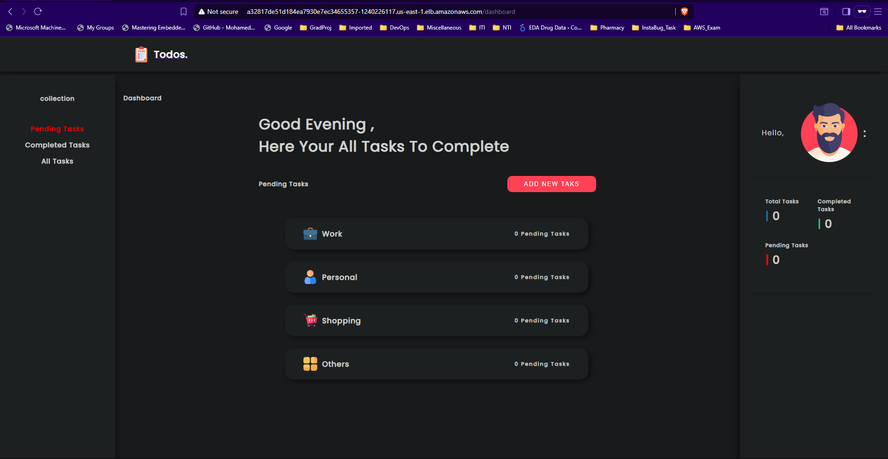

# Todo List Application Documentation

## 📋 Overview

This directory contains the **Todo List application** - a full-stack web application built with Node.js, Express.js, and MongoDB. The application provides a complete task management system with user authentication, task creation, and real-time updates.

## 🏗️ Credits

### [Application original repo ](https://github.com/osalem192/FortStak_ArgoCD.git)

## 🚀 Application 



## 🔧 Configuration

### Environment Variables

> **mongodb environment variable are represented as secrets in kubernetes**

### Database Configuration

**Location**: `config/mongoose.js`

```javascript
require('dotenv').config();

// require mongoose
const mongoose = require('mongoose');
// connect to database
mongoose.connect(process.env.MONGO_URI);

// acquire the connection (to check if it is successful)
const db = mongoose.connection;
// check for error
db.on('error', console.error.bind(console, 'connection error:'));
// once connection is open, log to console
db.once('open', function() {
    console.log('connected to database');
});
```

## 🐳 Docker Configuration

### Dockerfile

**Location**: `Dockerfile`

```dockerfile
FROM node:18-alpine

WORKDIR /app

COPY . .

RUN npm install

EXPOSE 4000

CMD ["npm", "start"]

```
