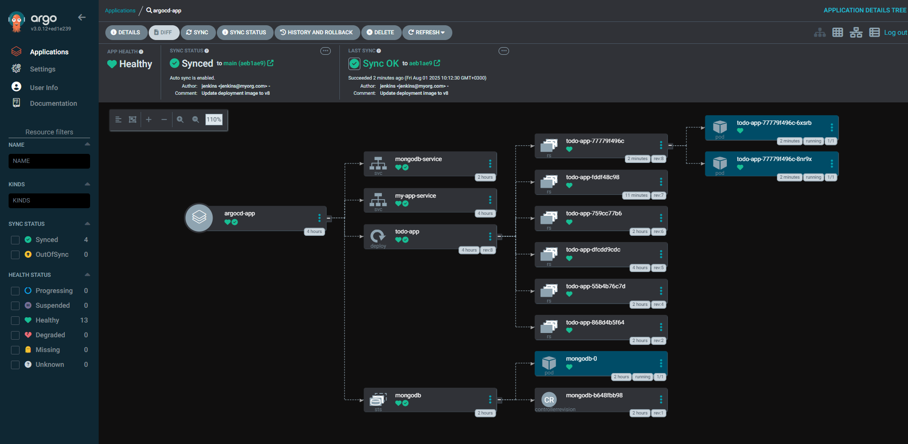

# Kubernetes Configuration Documentation

## 📋 Overview

This directory contains Kubernetes manifests for deploying the Todo List application in a production-ready Kubernetes cluster. The configuration includes application deployment, database setup, service configuration, and GitOps integration with ArgoCD.

## 🏗️ Directory Structure

```
Kubernetes/
├── README.md                    # This documentation file
├── app-deployment.yaml          # Todo application deployment and service
├── mongodb.yaml                 # MongoDB database deployment
├── mongodb-secret.yaml          # Database credentials secret
├── mongodb-admin-secret.yaml    # MongoDB admin credentials
└── argocd.yaml                 # ArgoCD application configuration
```

## 🚀 Application Deployment


### app-deployment.yaml

**Purpose**: Deploys the Todo List application with load balancing and resource management.

**Key Components**:

#### 1. Deployment Configuration
```yaml
apiVersion: apps/v1
kind: Deployment
metadata:
  name: todo-app
spec:
  replicas: 2                    # High availability with 2 replicas
  selector:
    matchLabels:
      app: todo-app
```

#### 2. Container Configuration
```yaml
containers:
- name: todo-app
  image: osalem192/updated-trialapp  # Docker image
  ports:
  - containerPort: 4000          # Application port
  env:
  - name: PORT
    value: "4000"
  - name: NODE_ENV
    value: "production"
```

#### 3. Database Connection
```yaml
env:
- name: MONGO_USERNAME
  valueFrom:
    secretKeyRef:
      name: mongodb-secret
      key: mongo-username
- name: MONGO_PASSWORD
  valueFrom:
    secretKeyRef:
      name: mongodb-secret
      key: mongo-password
- name: MONGO_HOST
  value: "mongodb-service:27017"
- name: MONGO_DB
  value: "todoDB"
- name: MONGO_URI
  value: "mongodb://$(MONGO_USERNAME):$(MONGO_PASSWORD)@$(MONGO_HOST)/$(MONGO_DB)?authSource=admin"
```

#### 4. Resource Management
```yaml
resources:
  requests:
    memory: "128Mi"
    cpu: "100m"
  limits:
    memory: "256Mi"
    cpu: "200m"
```

#### 5. Load Balancer Service
```yaml
apiVersion: v1
kind: Service
metadata:
  name: my-app-service
spec:
  type: LoadBalancer          # External access
  selector:
    app: todo-app
  ports:
    - port: 80
      targetPort: 4000
```

## 🗄️ Database Configuration

### mongodb.yaml

**Purpose**: Deploys MongoDB database with persistent storage.

**Key Features**:
- **Persistent Volume**: Data persistence across pod restarts
- **Service Discovery**: Internal service for application connectivity
- **Security**: Authentication enabled
- **Resource Limits**: CPU and memory constraints

**Configuration Details**:

#### 1. Persistent Volume Claim
```yaml
apiVersion: v1
kind: PersistentVolumeClaim
metadata:
  name: mongodb-pvc
spec:
  accessModes:
    - ReadWriteOnce
  resources:
    requests:
      storage: 1Gi
```

#### 2. MongoDB Deployment
```yaml
apiVersion: apps/v1
kind: Deployment
metadata:
  name: mongodb
spec:
  replicas: 1
  selector:
    matchLabels:
      app: mongodb
  template:
    spec:
      containers:
      - name: mongodb
        image: mongo:latest
        ports:
        - containerPort: 27017
        env:
        - name: MONGO_INITDB_ROOT_USERNAME
          valueFrom:
            secretKeyRef:
              name: mongodb-admin-secret
              key: mongo-admin-username
        - name: MONGO_INITDB_ROOT_PASSWORD
          valueFrom:
            secretKeyRef:
              name: mongodb-admin-secret
              key: mongo-admin-password
        volumeMounts:
        - name: mongodb-data
          mountPath: /data/db
```

#### 3. MongoDB Service
```yaml
apiVersion: v1
kind: Service
metadata:
  name: mongodb-service
spec:
  selector:
    app: mongodb
  ports:
    - port: 27017
      targetPort: 27017
```

### mongodb-secret.yaml

**Purpose**: Stores database credentials securely.

```yaml
apiVersion: v1
kind: Secret
metadata:
  name: mongodb-secret
type: Opaque
data:
  mongo-username: <base64-encoded-username>
  mongo-password: <base64-encoded-password>
```

### mongodb-admin-secret.yaml

**Purpose**: Stores MongoDB admin credentials.

```yaml
apiVersion: v1
kind: Secret
metadata:
  name: mongodb-admin-secret
type: Opaque
data:
  mongo-admin-username: <base64-encoded-admin-username>
  mongo-admin-password: <base64-encoded-admin-password>
```

## 🔄 GitOps with ArgoCD



### argocd.yaml

**Purpose**: Configures ArgoCD for automated GitOps deployment.

```yaml
apiVersion: argoproj.io/v1alpha1
kind: Application
metadata:
  name: todo-app
  namespace: argocd
spec:
  project: default
  source:
    repoURL: https://github.com/osalem192/CloudDevOpsProject_ArgoCD_SyncRepo.git
    targetRevision: main
    path: .
  destination:
    server: https://kubernetes.default.svc
    namespace: default
  syncPolicy:
    automated:
      prune: true
      selfHeal: true
    syncOptions:
    - CreateNamespace=true
```

**Key Features**:
- **Automated Sync**: Automatic deployment on Git changes
- **Self-Healing**: Automatic recovery from drift
- **Pruning**: Clean up removed resources
- **Namespace Creation**: Automatic namespace provisioning

## 🛠️ Deployment Instructions


### 1. Prerequisites

```bash
# Ensure kubectl is configured
kubectl cluster-info

# Verify cluster access
kubectl get nodes
```

### 2. Create Secrets

```bash
# Create MongoDB secrets
kubectl apply -f mongodb-admin-secret.yaml
kubectl apply -f mongodb-secret.yaml
```

### 3. Deploy Database

```bash
# Deploy MongoDB
kubectl apply -f mongodb.yaml

# Verify deployment
kubectl get pods -l app=mongodb
kubectl get services mongodb-service
```

### 4. Deploy Application

```bash
# Deploy Todo application
kubectl apply -f app-deployment.yaml

# Verify deployment
kubectl get pods -l app=todo-app
kubectl get services my-app-service
```

### 5. Setup ArgoCD (Optional)

```bash
# Install ArgoCD
kubectl create namespace argocd
kubectl apply -n argocd -f https://raw.githubusercontent.com/argoproj/argo-cd/stable/manifests/install.yaml

# Apply ArgoCD application
kubectl apply -f argocd.yaml
```

## 🔍 Monitoring and Management

### Health Checks

```bash
# Check pod status
kubectl get pods

# Check services
kubectl get services

# Check deployments
kubectl get deployments

# Check persistent volumes
kubectl get pvc
```

### Logs and Debugging

```bash
# Application logs
kubectl logs -f deployment/todo-app

# MongoDB logs
kubectl logs -f deployment/mongodb

# Describe resources for troubleshooting
kubectl describe pod <pod-name>
kubectl describe service <service-name>
```

### Scaling

```bash
# Scale application
kubectl scale deployment todo-app --replicas=3

# Check scaling status
kubectl get deployment todo-app
```

## 🔐 Security Considerations

### 1. Secrets Management
- Use Kubernetes secrets for sensitive data
- Consider external secret management (HashiCorp Vault, AWS Secrets Manager)
- Rotate credentials regularly

### 2. Network Policies
```yaml
apiVersion: networking.k8s.io/v1
kind: NetworkPolicy
metadata:
  name: todo-app-network-policy
spec:
  podSelector:
    matchLabels:
      app: todo-app
  policyTypes:
  - Ingress
  - Egress
  ingress:
  - from:
    - namespaceSelector:
        matchLabels:
          name: ingress-nginx
    ports:
    - protocol: TCP
      port: 4000
```

### 3. RBAC Configuration
```yaml
apiVersion: rbac.authorization.k8s.io/v1
kind: Role
metadata:
  namespace: default
  name: todo-app-role
rules:
- apiGroups: [""]
  resources: ["pods", "services"]
  verbs: ["get", "list", "watch"]
```

## 📊 Resource Optimization

### 1. Horizontal Pod Autoscaler
```yaml
apiVersion: autoscaling/v2
kind: HorizontalPodAutoscaler
metadata:
  name: todo-app-hpa
spec:
  scaleTargetRef:
    apiVersion: apps/v1
    kind: Deployment
    name: todo-app
  minReplicas: 2
  maxReplicas: 10
  metrics:
  - type: Resource
    resource:
      name: cpu
      target:
        type: Utilization
        averageUtilization: 70
```

### 2. Resource Quotas
```yaml
apiVersion: v1
kind: ResourceQuota
metadata:
  name: todo-app-quota
spec:
  hard:
    requests.cpu: "4"
    requests.memory: 8Gi
    limits.cpu: "8"
    limits.memory: 16Gi
```

## 🔄 CI/CD Integration

### Jenkins Pipeline Integration

The Kubernetes manifests are automatically updated by the Jenkins pipeline:

```groovy
// In Jenkinsfile
stage('Update Deployment YAML') {
    steps {
        script {
            sh "sed -i 's|image:.*|image: ${IMAGE_NAME}:${IMAGE_TAG}|' Kubernetes/app-deployment.yaml"
        }
    }
}
```

### ArgoCD Sync

ArgoCD automatically syncs changes from the GitOps repository:

```bash
# Check ArgoCD application status
kubectl get applications -n argocd

# Manual sync (if needed)
argocd app sync todo-app
```

## 🚨 Troubleshooting

### Common Issues

#### 1. Pod Startup Issues
```bash
# Check pod events
kubectl describe pod <pod-name>

# Check pod logs
kubectl logs <pod-name>

# Check resource constraints
kubectl top pods
```

#### 2. Service Connectivity
```bash
# Test service connectivity
kubectl run test-pod --image=busybox --rm -it --restart=Never -- nslookup mongodb-service

# Check service endpoints
kubectl get endpoints mongodb-service
```

#### 3. Database Connection Issues
```bash
# Verify MongoDB is running
kubectl exec -it <mongodb-pod> -- mongo --username <username> --password <password>

# Check MongoDB logs
kubectl logs -f deployment/mongodb
```

#### 4. ArgoCD Sync Issues
```bash
# Check ArgoCD application status
argocd app get todo-app

# Check sync history
argocd app history todo-app

# Force sync
argocd app sync todo-app --force
```

## 📈 Best Practices

### 1. Resource Management
- Set appropriate resource requests and limits
- Use Horizontal Pod Autoscaler for scaling
- Monitor resource usage regularly

### 2. Security
- Use secrets for sensitive data
- Implement network policies
- Regular security updates
- RBAC for access control

### 3. Monitoring
- Implement health checks
- Set up logging and monitoring
- Use Prometheus and Grafana
- Configure alerts

### 4. Backup and Recovery
- Regular database backups
- Persistent volume snapshots
- Disaster recovery plan
- Test recovery procedures

## 🔄 Updates and Maintenance

### - CI is mentained by Jenkins whenever code is pushed to github repo and 
### - CD is handeled by ArgoCD as it syncs to dedicated repo https://github.com/osalem192/CloudDevOpsProject_ArgoCD_SyncRepo.git.


---

**Note**: Always test deployments in a development environment before applying to production. Keep manifests in version control and use GitOps for automated deployments. 