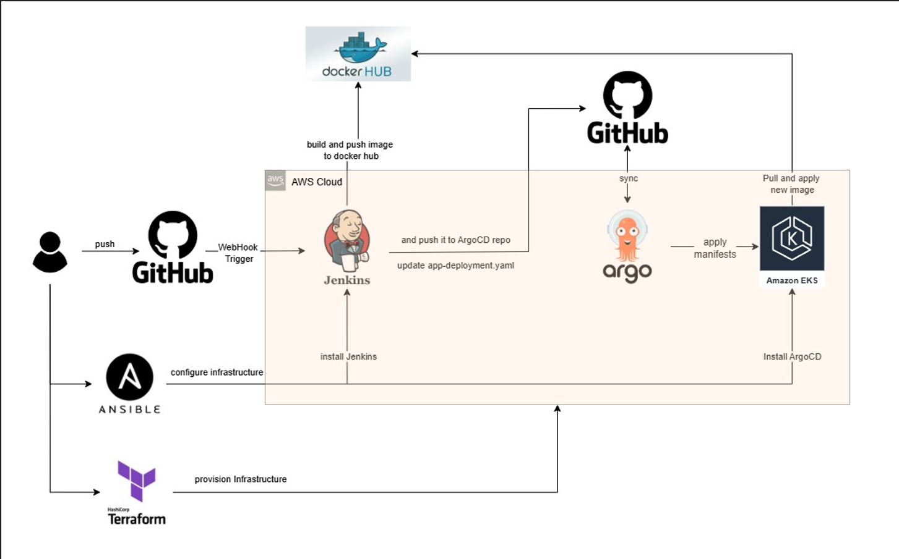
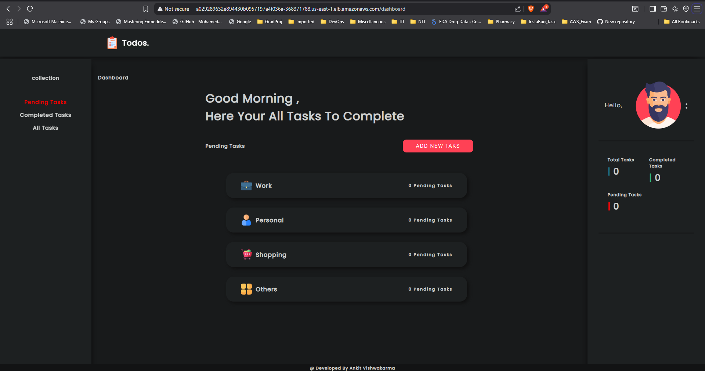
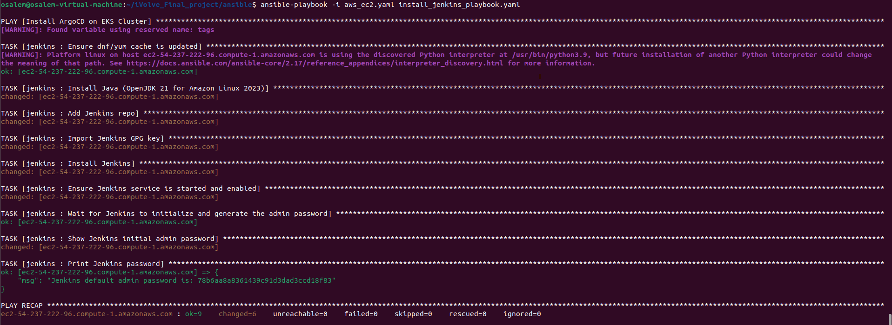

# iVolve Final Project - Complete CI/CD Pipeline with Kubernetes

## 📋 Table of Contents

- [Architecture Overview](#architecture-overview)
- [Application Details](#application-details)
- [Project Overview](#project-overview)
- [Infrastructure Components](#infrastructure-components)
- [CI/CD Pipeline](#cicd-pipeline)
- [Prerequisites](#prerequisites)
- [Installation & Setup](#installation--setup)
- [Usage](#usage)
- [Monitoring & Troubleshooting](#monitoring--troubleshooting)
- [Security Considerations](#security-considerations)

## 🏗️ Architecture Overview



## 🚀 Project Overview

### 1. Infrastructure Provisioning (Terraform)
- Provisions an **EC2 instance** for Jenkins.
- Provisions an **EKS (Elastic Kubernetes Service)** cluster for application deployment.
- Creates necessary **IAM roles**, **VPC**, **subnets**, and **security groups**.
- Sets up **remote backend** for storing Terraform state (e.g., S3 + DynamoDB).

### 2. Configuration Management (Ansible)
- Installs **Docker** on the EC2 instance.
- Installs and configures **Jenkins** on the EC2 instance.
- Installs and configures **ArgoCD** on the EKS cluster.

### 3. CI/CD Workflow

#### Continuous Integration (CI)
- A **GitHub webhook** triggers the Jenkins pipeline on code push.
- Jenkins pipeline steps:
  - Clones the application code from GitHub.
  - Builds a Docker image for the Node.js app.
  - Pushes the image to **Docker Hub**.
  - Updates the `app-deployment.yaml` with the new image tag.
  - Pushes the updated `app-deployment.yaml` to a [**separate GitHub repository**](https://github.com/osalem192/CloudDevOpsProject_ArgoCD_SyncRepo.git) for ArgoCD.

#### Continuous Deployment (CD)
- **ArgoCD** monitors the GitHub repository containing the Kubernetes manifests.
- When `app-deployment.yaml` is updated:
  - ArgoCD automatically **syncs** the changes.
  - ArgoCD deploys the updated Node.js app to the **EKS cluster**.

### 4. Application Stack
- **Backend**: Node.js application.
- **Database**: MongoDB (deployed in Kubernetes).


### Technology Stack

- **Infrastructure as Code**: Terraform
- **CI/CD**: Jenkins
- **Containerization**: Docker
- **Orchestration**: Kubernetes
- **GitOps**: ArgoCD
- **Application**: Node.js + Express + EJS
- **Database**: MongoDB
- **Cloud Provider**: AWS

## 🏛️ Infrastructure Components

### 1. Terraform Infrastructure

**Location**: `Terraform/`

The infrastructure is modular and includes:

#### Network Module (`modules/network/`)
- **VPC** with custom CIDR block
- **Public Subnets** across multiple Availability Zones
- **Internet Gateway** for external connectivity
- **Route Tables** for traffic routing
- **Network ACLs** for security

#### Server Module (`modules/server/`)
- **Auto Scaling Group** for high availability
- **Launch Template** with latest Amazon Linux 2023
- **Security Groups** for controlled access
- **CloudWatch** monitoring and logging

#### Key Features:
- **High Availability**: Multi-AZ deployment
- **Auto Scaling**: Automatic scaling based on demand
- **Security**: Network ACLs and Security Groups
- **Monitoring**: CloudWatch integration
- **State Management**: S3 backend for Terraform state

### 2. Kubernetes Configuration

**Location**: `Kubernetes/`

#### Components:
- **app-deployment.yaml**: Todo application deployment
- **mongodb.yaml**: MongoDB database deployment
- **mongodb-secret.yaml**: Database credentials
- **argocd.yaml**: ArgoCD application configuration

#### Features:
- **Load Balancing**: LoadBalancer service type
- **Resource Management**: CPU and memory limits
- **Environment Variables**: Secure configuration
- **Health Checks**: Application readiness
- **Scaling**: Horizontal Pod Autoscaler ready

### 3. Ansible Automation

**Location**: `Ansible/`


#### Playbooks:
- **Install_jenkins_playbook.yaml**: Jenkins installation
- **EKS_ansible_playbook.yaml**: EKS cluster setup
- **aws_ec2.yaml**: EC2 instance management

#### Roles:
- **jenkins/**: Complete Jenkins installation and configuration
- **eks/**: EKS cluster provisioning

## 🔄 CI/CD Pipeline

### Jenkins Pipeline

**Location**: `Jenkinsfile`


The pipeline consists of 6 stages:

1. **Clone Repository**
   - Clones the source code from GitHub

2. **Build Docker Image**
   - Builds the application container image
   - Tags with build ID for versioning

3. **Push Docker Image**
   - Pushes image to Docker Hub
   - Uses secure credentials

4. **Delete Local Docker Image**
   - Cleans up local resources

5. **Update Deployment YAML**
   - Updates Kubernetes deployment with new image tag
   - Prepares for GitOps deployment

6. **Update ArgoCD Repo**
   - Commits changes to Dedicated [GitOps repository](https://github.com/osalem192/CloudDevOpsProject_ArgoCD_SyncRepo.git)
   - Triggers ArgoCD sync

### GitOps with ArgoCD


- **Automated Deployment**: Changes in Git trigger deployments
- **Rollback Capability**: Easy rollback to previous versions
- **Declarative Configuration**: Infrastructure as code
- **Multi-environment Support**: Dev, staging, production

## 📋 Prerequisites

### Required Tools
- **Terraform** (v1.0+)
- **Docker** (v20.0+)
- **kubectl** (v1.24+)
- **Ansible** (v2.12+)
- **AWS CLI** (v2.0+)

### Required Accounts
- **AWS Account** with appropriate permissions
- **Docker Hub** account
- **GitHub** account
- **Jenkins** instance

### Required Credentials
- AWS Access Keys
- Docker Hub credentials
- GitHub Personal Access Token

## 🛠️ Tools Installation

### All Tools were Installed using ansible

## 🚀 Usage

### Running the Application



1. **Access the Application**:
   ```bash
   # Get the LoadBalancer URL
   kubectl get service my-app-service
   ```

2. **Application Features**:
   - Register new user account
   - Create and manage todo tasks
   - Mark tasks as complete
   - Delete tasks
   - View all tasks and completed tasks


### Monitoring the Pipeline



1. **Jenkins Dashboard**: Monitor CI/CD pipeline status
2. **ArgoCD Dashboard**: Track GitOps deployments
3. **Kubernetes Dashboard**: Monitor application health
4. **CloudWatch**: Infrastructure monitoring


## 🔍 Monitoring & Troubleshooting

### Common Issues

#### 1. Jenkins Pipeline Failures
- Check Docker Hub credentials
- Verify GitHub repository access
- Review Jenkins logs

#### 2. Kubernetes Deployment Issues
- Check pod status: `kubectl get pods`
- View pod logs: `kubectl logs <pod-name>`
- Check service connectivity

#### 3. Database Connection Issues
- Verify MongoDB secret exists
- Check network policies
- Validate connection string

### Logging

- **Application Logs**: `kubectl logs -f deployment/todo-app`
- **Jenkins Logs**: Jenkins console output
- **Infrastructure Logs**: CloudWatch logs

## 🔒 Security Considerations

### Infrastructure Security
- **Network Security**: VPC with private subnets
- **Access Control**: IAM roles and policies
- **Encryption**: Data encryption at rest and in transit

### Application Security
- **Secrets Management**: Kubernetes secrets
- **Container Security**: Non-root user in containers
- **Network Policies**: Pod-to-pod communication control

### CI/CD Security
- **Credential Management**: Jenkins credentials
- **Image Scanning**: Docker image vulnerability scanning
- **Access Control**: Git repository permissions


## Author
### while all the DevOps work is mine, The code isn't. Here is the original code repo: [Here is the original code repo:](https://github.com/Ankit6098/Todo-List-nodejs) 

