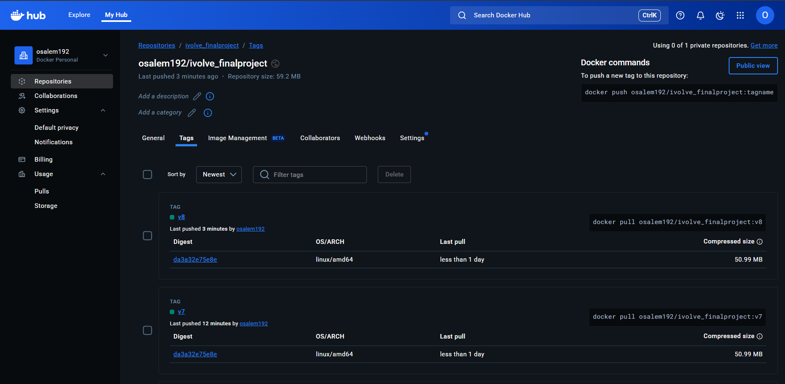

# Terraform Infrastructure Documentation

## 📋 Overview

This directory contains Terraform configurations for provisioning a highly available AWS infrastructure for the iVolve Final Project. The infrastructure is designed with modularity, scalability, and security in mind, supporting the complete CI/CD pipeline and application deployment.

## 🏗️ Directory Structure

```
Terraform/
├── README.md                    # This documentation file
├── main.tf                      # Main Terraform configuration
├── variables.tf                 # Input variables
├── outputs.tf                   # Output values
├── backend.tf                   # Remote state configuration
├── .terraform.lock.hcl         # Dependency lock file
└── modules/
    ├── network/                 # Network infrastructure module
    │   ├── main.tf             # VPC, subnets, routing
    │   ├── variables.tf        # Network module variables
    │   └── outputs.tf          # Network module outputs
    └── server/                 # Server infrastructure module
        ├── main.tf             # EC2, ASG, security groups
        ├── variables.tf        # Server module variables
        └── outputs.tf          # Server module outputs
```

## 🏛️ Infrastructure Architecture



### High-Level Design

```
┌─────────────────────────────────────────────────────────────┐
│                        AWS Cloud                            │
├─────────────────────────────────────────────────────────────┤
│  ┌─────────────────┐    ┌─────────────────┐                │
│  │   Public Subnet │    │   Public Subnet │                │
│  │   (AZ-1a)       │    │   (AZ-1b)       │                │
│  │                 │    │                 │                │
│  │  ┌─────────────┐│    │  ┌─────────────┐│                │
│  │  │   EC2       ││    │  │   EC2       ││                │
│  │  │  Instance   ││    │  │  Instance   ││                │
│  │  │             ││    │  │             ││                │
│  │  └─────────────┘│    │  └─────────────┘│                │
│  └─────────────────┘    └─────────────────┘                │
│           │                       │                        │
│           └───────────────────────┼────────────────────────┘
│                                   │
│  ┌─────────────────────────────────┼─────────────────────┐  │
│  │            VPC                   │                     │  │
│  │      (10.0.0.0/16)              │                     │  │
│  │                                 │                     │  │
│  │  ┌─────────────────────────────┐ │                     │  │
│  │  │      Internet Gateway       │ │                     │  │
│  │  └─────────────────────────────┘ │                     │  │
│  │                                 │                     │  │
│  │  ┌─────────────────────────────┐ │                     │  │
│  │  │      Route Tables           │ │                     │  │
│  │  └─────────────────────────────┘ │                     │  │
│  │                                 │                     │  │
│  │  ┌─────────────────────────────┐ │                     │  │
│  │  │      Security Groups        │ │                     │  │
│  │  └─────────────────────────────┘ │                     │  │
│  └─────────────────────────────────┼─────────────────────┘  │
│                                   │                        │
│  ┌─────────────────────────────────┼─────────────────────┐  │
│  │         Auto Scaling Group      │                     │  │
│  │                                 │                     │  │
│  │  ┌─────────────────────────────┐ │                     │  │
│  │  │      Launch Template        │ │                     │  │
│  │  └─────────────────────────────┘ │                     │  │
│  └─────────────────────────────────┼─────────────────────┘  │
│                                   │                        │
│  ┌─────────────────────────────────┼─────────────────────┐  │
│  │         CloudWatch              │                     │  │
│  │      Monitoring & Logging       │                     │  │
│  └─────────────────────────────────┼─────────────────────┘  │
└───────────────────────────────────┼────────────────────────┘
                                    │
┌───────────────────────────────────┼────────────────────────┐
│         S3 Backend                │                        │
│    Terraform State Storage        │                        │
└───────────────────────────────────┴────────────────────────┘
```

## 🔧 Configuration Files

### main.tf

**Purpose**: Main Terraform configuration that orchestrates the infrastructure deployment.

**Key Components**:

```hcl
# Configure AWS Provider
provider "aws" {
  region = var.aws_region
}

# Call Network Module
module "network" {
  source = "./modules/network"
  
  vpc_cidr_block = var.vpc_cidr_block
  environment    = var.environment
  project_name   = var.project_name
}

# Call Server Module
module "server" {
  source = "./modules/server"
  
  vpc_id         = module.network.vpc_id
  subnet_ids     = module.network.public_subnet_ids
  environment    = var.environment
  project_name   = var.project_name
}
```

### variables.tf

**Purpose**: Defines all input variables with descriptions and default values.

**Key Variables**:

```hcl
variable "aws_region" {
  description = "AWS region for resource deployment"
  type        = string
  default     = "us-west-2"
}

variable "vpc_cidr_block" {
  description = "CIDR block for VPC"
  type        = string
  default     = "10.0.0.0/16"
}

variable "environment" {
  description = "Environment name (dev, staging, prod)"
  type        = string
  default     = "dev"
}

variable "project_name" {
  description = "Project name for resource tagging"
  type        = string
  default     = "ivolve-final-project"
}
```

### outputs.tf

**Purpose**: Defines output values for use by other modules or external systems.

**Key Outputs**:

```hcl
output "vpc_id" {
  description = "ID of the created VPC"
  value       = module.network.vpc_id
}

output "public_subnet_ids" {
  description = "IDs of the public subnets"
  value       = module.network.public_subnet_ids
}

output "security_group_id" {
  description = "ID of the security group"
  value       = module.server.security_group_id
}

output "auto_scaling_group_name" {
  description = "Name of the Auto Scaling Group"
  value       = module.server.auto_scaling_group_name
}
```

### backend.tf

**Purpose**: Configures remote state storage in S3 for team collaboration.

```hcl
terraform {
  backend "s3" {
    bucket = "ivolve-terraform-state"
    key    = "infrastructure/terraform.tfstate"
    region = "us-west-2"
    
    # Enable state locking
    dynamodb_table = "terraform-state-lock"
    
    # Enable encryption
    encrypt = true
  }
}
```

## 🧩 Modules

### Network Module (`modules/network/`)

**Purpose**: Creates and manages network infrastructure components.

#### main.tf

```hcl
# VPC
resource "aws_vpc" "main" {
  cidr_block           = var.vpc_cidr_block
  enable_dns_hostnames = true
  enable_dns_support   = true
  
  tags = {
    Name        = "${var.project_name}-vpc"
    Environment = var.environment
  }
}

# Public Subnets
resource "aws_subnet" "public" {
  count             = length(var.availability_zones)
  vpc_id            = aws_vpc.main.id
  cidr_block        = cidrsubnet(var.vpc_cidr_block, 8, count.index)
  availability_zone = var.availability_zones[count.index]
  
  map_public_ip_on_launch = true
  
  tags = {
    Name        = "${var.project_name}-public-subnet-${count.index + 1}"
    Environment = var.environment
  }
}

# Internet Gateway
resource "aws_internet_gateway" "main" {
  vpc_id = aws_vpc.main.id
  
  tags = {
    Name        = "${var.project_name}-igw"
    Environment = var.environment
  }
}

# Route Table
resource "aws_route_table" "public" {
  vpc_id = aws_vpc.main.id
  
  route {
    cidr_block = "0.0.0.0/0"
    gateway_id = aws_internet_gateway.main.id
  }
  
  tags = {
    Name        = "${var.project_name}-public-rt"
    Environment = var.environment
  }
}

# Route Table Association
resource "aws_route_table_association" "public" {
  count          = length(aws_subnet.public)
  subnet_id      = aws_subnet.public[count.index].id
  route_table_id = aws_route_table.public.id
}
```

#### variables.tf

```hcl
variable "vpc_cidr_block" {
  description = "CIDR block for VPC"
  type        = string
}

variable "availability_zones" {
  description = "List of availability zones"
  type        = list(string)
  default     = ["us-west-2a", "us-west-2b"]
}

variable "environment" {
  description = "Environment name"
  type        = string
}

variable "project_name" {
  description = "Project name"
  type        = string
}
```

#### outputs.tf

```hcl
output "vpc_id" {
  description = "ID of the VPC"
  value       = aws_vpc.main.id
}

output "public_subnet_ids" {
  description = "IDs of the public subnets"
  value       = aws_subnet.public[*].id
}

output "internet_gateway_id" {
  description = "ID of the Internet Gateway"
  value       = aws_internet_gateway.main.id
}
```

### Server Module (`modules/server/`)

**Purpose**: Creates and manages compute resources and security configurations.

#### main.tf

```hcl
# Security Group
resource "aws_security_group" "main" {
  name_prefix = "${var.project_name}-sg"
  vpc_id      = var.vpc_id
  
  # SSH access
  ingress {
    from_port   = 22
    to_port     = 22
    protocol    = "tcp"
    cidr_blocks = ["0.0.0.0/0"]
  }
  
  # HTTP access
  ingress {
    from_port   = 80
    to_port     = 80
    protocol    = "tcp"
    cidr_blocks = ["0.0.0.0/0"]
  }
  
  # HTTPS access
  ingress {
    from_port   = 443
    to_port     = 443
    protocol    = "tcp"
    cidr_blocks = ["0.0.0.0/0"]
  }
  
  # Jenkins access
  ingress {
    from_port   = 8080
    to_port     = 8080
    protocol    = "tcp"
    cidr_blocks = ["0.0.0.0/0"]
  }
  
  # All outbound traffic
  egress {
    from_port   = 0
    to_port     = 0
    protocol    = "-1"
    cidr_blocks = ["0.0.0.0/0"]
  }
  
  tags = {
    Name        = "${var.project_name}-security-group"
    Environment = var.environment
  }
}

# Launch Template
resource "aws_launch_template" "main" {
  name_prefix   = "${var.project_name}-lt"
  image_id      = var.ami_id
  instance_type = var.instance_type
  
  network_interfaces {
    associate_public_ip_address = true
    security_groups             = [aws_security_group.main.id]
  }
  
  user_data = base64encode(templatefile("${path.module}/user_data.sh", {
    project_name = var.project_name
  }))
  
  iam_instance_profile {
    name = aws_iam_instance_profile.main.name
  }
  
  tag_specifications {
    resource_type = "instance"
    tags = {
      Name        = "${var.project_name}-instance"
      Environment = var.environment
    }
  }
}

# Auto Scaling Group
resource "aws_autoscaling_group" "main" {
  name                = "${var.project_name}-asg"
  desired_capacity    = var.desired_capacity
  max_size           = var.max_size
  min_size           = var.min_size
  target_group_arns  = [aws_lb_target_group.main.arn]
  vpc_zone_identifier = var.subnet_ids
  
  launch_template {
    id      = aws_launch_template.main.id
    version = "$Latest"
  }
  
  tag {
    key                 = "Name"
    value              = "${var.project_name}-asg"
    propagate_at_launch = true
  }
  
  tag {
    key                 = "Environment"
    value              = var.environment
    propagate_at_launch = true
  }
}

# Application Load Balancer
resource "aws_lb" "main" {
  name               = "${var.project_name}-alb"
  internal           = false
  load_balancer_type = "application"
  security_groups    = [aws_security_group.main.id]
  subnets            = var.subnet_ids
  
  enable_deletion_protection = false
  
  tags = {
    Name        = "${var.project_name}-alb"
    Environment = var.environment
  }
}

# Target Group
resource "aws_lb_target_group" "main" {
  name     = "${var.project_name}-tg"
  port     = 80
  protocol = "HTTP"
  vpc_id   = var.vpc_id
  
  health_check {
    enabled             = true
    healthy_threshold   = 2
    interval            = 30
    matcher             = "200"
    path                = "/"
    port                = "traffic-port"
    protocol            = "HTTP"
    timeout             = 5
    unhealthy_threshold = 2
  }
}

# Listener
resource "aws_lb_listener" "main" {
  load_balancer_arn = aws_lb.main.arn
  port              = "80"
  protocol          = "HTTP"
  
  default_action {
    type             = "forward"
    target_group_arn = aws_lb_target_group.main.arn
  }
}

# IAM Role
resource "aws_iam_role" "main" {
  name = "${var.project_name}-ec2-role"
  
  assume_role_policy = jsonencode({
    Version = "2012-10-17"
    Statement = [
      {
        Action = "sts:AssumeRole"
        Effect = "Allow"
        Principal = {
          Service = "ec2.amazonaws.com"
        }
      }
    ]
  })
}

# IAM Instance Profile
resource "aws_iam_instance_profile" "main" {
  name = "${var.project_name}-ec2-profile"
  role = aws_iam_role.main.name
}

# CloudWatch Log Group
resource "aws_cloudwatch_log_group" "main" {
  name              = "/aws/ec2/${var.project_name}"
  retention_in_days = 14
}
```

#### variables.tf

```hcl
variable "vpc_id" {
  description = "ID of the VPC"
  type        = string
}

variable "subnet_ids" {
  description = "List of subnet IDs"
  type        = list(string)
}

variable "ami_id" {
  description = "AMI ID for EC2 instances"
  type        = string
  default     = "ami-0735c191cf914754d" # Amazon Linux 2023
}

variable "instance_type" {
  description = "EC2 instance type"
  type        = string
  default     = "t3.medium"
}

variable "desired_capacity" {
  description = "Desired number of instances"
  type        = number
  default     = 2
}

variable "max_size" {
  description = "Maximum number of instances"
  type        = number
  default     = 4
}

variable "min_size" {
  description = "Minimum number of instances"
  type        = number
  default     = 1
}

variable "environment" {
  description = "Environment name"
  type        = string
}

variable "project_name" {
  description = "Project name"
  type        = string
}
```

#### outputs.tf

```hcl
output "security_group_id" {
  description = "ID of the security group"
  value       = aws_security_group.main.id
}

output "auto_scaling_group_name" {
  description = "Name of the Auto Scaling Group"
  value       = aws_autoscaling_group.main.name
}

output "load_balancer_dns" {
  description = "DNS name of the load balancer"
  value       = aws_lb.main.dns_name
}

output "target_group_arn" {
  description = "ARN of the target group"
  value       = aws_lb_target_group.main.arn
}
```

## 🚀 Deployment Instructions

### 1. Prerequisites

```bash
# Install Terraform
# Download from https://www.terraform.io/downloads.html

# Configure AWS CLI
aws configure

# Verify AWS credentials
aws sts get-caller-identity
```

### 2. Initialize Terraform

```bash
# Navigate to Terraform directory
cd Terraform/

# Initialize Terraform
terraform init

# Verify initialization
terraform version
```

### 3. Plan Deployment

```bash
# Review the deployment plan
terraform plan

# Plan with specific variables
terraform plan -var="environment=prod" -var="desired_capacity=3"
```

### 4. Apply Infrastructure

```bash
# Apply the configuration
terraform apply

# Apply with auto-approve (use with caution)
terraform apply -auto-approve

# Apply with specific variables
terraform apply -var="environment=prod"
```

### 5. Verify Deployment

```bash
# Check resource status
terraform show

# List all resources
terraform state list

# Get specific output
terraform output load_balancer_dns
```

## 🔍 Monitoring and Management

### CloudWatch Integration

The infrastructure includes CloudWatch monitoring:

```hcl
# CloudWatch Dashboard
resource "aws_cloudwatch_dashboard" "main" {
  dashboard_name = "${var.project_name}-dashboard"
  
  dashboard_body = jsonencode({
    widgets = [
      {
        type   = "metric"
        x      = 0
        y      = 0
        width  = 12
        height = 6
        
        properties = {
          metrics = [
            ["AWS/EC2", "CPUUtilization", "AutoScalingGroupName", aws_autoscaling_group.main.name],
            [".", "NetworkIn", ".", "."],
            [".", "NetworkOut", ".", "."]
          ]
          period = 300
          stat   = "Average"
          region = var.aws_region
          title  = "EC2 Metrics"
        }
      }
    ]
  })
}
```

### Logging Configuration

```hcl
# CloudWatch Log Group for Application Logs
resource "aws_cloudwatch_log_group" "application" {
  name              = "/aws/application/${var.project_name}"
  retention_in_days = 30
}

# CloudWatch Log Group for System Logs
resource "aws_cloudwatch_log_group" "system" {
  name              = "/aws/system/${var.project_name}"
  retention_in_days = 14
}
```

## 🔐 Security Considerations

### 1. Network Security

- **VPC**: Isolated network environment
- **Security Groups**: Restrictive inbound/outbound rules
- **Network ACLs**: Additional network layer security
- **Private Subnets**: For sensitive resources (future enhancement)

### 2. Access Control

- **IAM Roles**: Least privilege access for EC2 instances
- **IAM Policies**: Specific permissions for required services
- **Security Groups**: Port-specific access control

### 3. Data Protection

- **Encryption**: Data encryption at rest and in transit
- **Backup**: Automated backup strategies
- **Monitoring**: Security event monitoring

## 📊 Cost Optimization

### 1. Instance Management

```hcl
# Auto Scaling for cost optimization
resource "aws_autoscaling_policy" "scale_up" {
  name                   = "${var.project_name}-scale-up"
  scaling_adjustment     = 1
  adjustment_type        = "ChangeInCapacity"
  cooldown              = 300
  autoscaling_group_name = aws_autoscaling_group.main.name
}

resource "aws_autoscaling_policy" "scale_down" {
  name                   = "${var.project_name}-scale-down"
  scaling_adjustment     = -1
  adjustment_type        = "ChangeInCapacity"
  cooldown              = 300
  autoscaling_group_name = aws_autoscaling_group.main.name
}
```

### 2. Resource Tagging

```hcl
# Cost allocation tags
locals {
  common_tags = {
    Project     = var.project_name
    Environment = var.environment
    Owner       = "DevOps Team"
    CostCenter  = "IT-001"
    ManagedBy   = "Terraform"
  }
}
```

## 🔄 CI/CD Integration

### Jenkins Integration

```groovy
// In Jenkinsfile
stage('Infrastructure') {
    steps {
        script {
            dir('Terraform') {
                sh 'terraform init'
                sh 'terraform plan -out=tfplan'
                sh 'terraform apply tfplan'
            }
        }
    }
}
```

### GitHub Actions Integration

```yaml
# .github/workflows/terraform.yml
name: 'Terraform'

on:
  push:
    branches: [ main ]
    paths: [ 'Terraform/**' ]

jobs:
  terraform:
    runs-on: ubuntu-latest
    steps:
    - uses: actions/checkout@v2
    
    - name: Setup Terraform
      uses: hashicorp/setup-terraform@v1
      
    - name: Terraform Init
      run: terraform init
      working-directory: ./Terraform
      
    - name: Terraform Plan
      run: terraform plan
      working-directory: ./Terraform
      
    - name: Terraform Apply
      run: terraform apply -auto-approve
      working-directory: ./Terraform
```

## 🚨 Troubleshooting

### Common Issues

#### 1. State Lock Issues
```bash
# Force unlock state (use with caution)
terraform force-unlock <lock-id>

# Check state status
terraform state list
```

#### 2. Provider Issues
```bash
# Update provider plugins
terraform init -upgrade

# Clear provider cache
rm -rf .terraform
terraform init
```

#### 3. Resource Conflicts
```bash
# Import existing resources
terraform import aws_vpc.main vpc-12345678

# Refresh state
terraform refresh
```

#### 4. Variable Issues
```bash
# Check variable values
terraform plan -var-file=production.tfvars

# Validate variables
terraform validate
```

### Debugging Commands

```bash
# Enable debug logging
export TF_LOG=DEBUG
export TF_LOG_PATH=terraform.log

# Run with debug output
terraform plan -detailed-exitcode

# Check resource dependencies
terraform graph | dot -Tsvg > graph.svg
```

## 📈 Best Practices

### 1. State Management
- Use remote state storage (S3)
- Enable state locking (DynamoDB)
- Use workspaces for environment separation
- Regular state backups

### 2. Security
- Use IAM roles instead of access keys
- Implement least privilege access
- Regular security audits
- Encrypt sensitive data

### 3. Cost Management
- Use appropriate instance types
- Implement auto-scaling
- Regular cost reviews
- Resource tagging for cost allocation

### 4. Maintenance
- Regular Terraform updates
- Dependency updates
- Security patch management
- Documentation updates

## 🔄 Updates and Maintenance

### Infrastructure Updates

```bash
# Update infrastructure
terraform plan
terraform apply

# Update specific resources
terraform apply -target=aws_autoscaling_group.main

# Import new resources
terraform import aws_instance.new_instance i-12345678
```

### Module Updates

```bash
# Update module source
terraform get -update

# Validate module changes
terraform validate
```

### State Management

```bash
# Move resources between states
terraform state mv aws_instance.old aws_instance.new

# Remove resources from state
terraform state rm aws_instance.old

# List state resources
terraform state list
```

## 📞 Support

For Terraform-related issues:
1. Check the troubleshooting section
2. Review Terraform logs
3. Validate configuration files
4. Check AWS service limits
5. Consult Terraform documentation

---

**Note**: Always test infrastructure changes in a development environment before applying to production. Use version control for all Terraform configurations and implement proper change management procedures. 